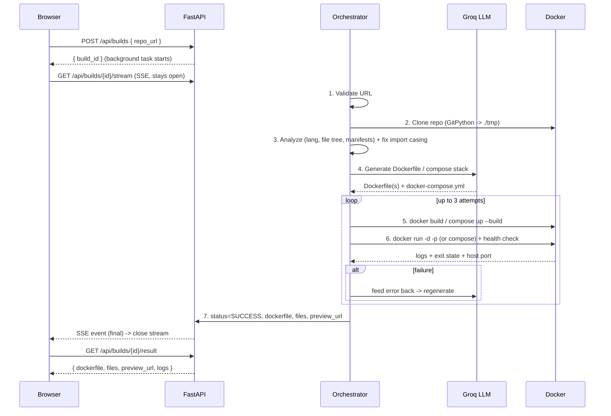

# 🐳 DockerForge

**Paste a GitHub URL → get a working, build-tested Dockerfile and a live preview.**

DockerForge is an AI-powered containerization tool. Give it any public GitHub repository and it clones the code, analyzes the stack with an LLM, generates a Dockerfile (or a full `docker-compose` stack for multi-service repos), then **builds and runs it inside Docker to prove it actually works** — automatically fixing and retrying up to 3 times on failure. Every successful build is left running so you can open the app live in your browser.

---

## ✨ Features

| Feature | Description |
| --- | --- |
| **One-paste builds** | Drop a GitHub URL; DockerForge detects language, framework, ports and entrypoints automatically. |
| **Self-healing** | Build/run errors are fed back to the LLM and the Dockerfile is regenerated (max 3 attempts). |
| **Full-stack aware** | For monorepos (backend + frontend) it generates per-service Dockerfiles **and** a `docker-compose.yml`, then previews the **frontend**. |
| **Smart start command** | Uses `npm start` only when a `start` script exists, otherwise runs the entry file directly (`node server.js`). |
| **Linux-safe source** | Auto-fixes case-mismatched imports (`./Loginpopup` → `./LoginPopup`) that build on Windows/macOS but break in a case-sensitive Linux container. |
| **Clean build context** | Recursively excludes committed `node_modules` / `__pycache__` / virtualenvs so host-compiled native binaries never leak into the image. |
| **Live preview** | Successful builds stay running on an auto-assigned host port; the UI shows an "Open running app" link. Only the latest build is kept alive. |
| **Real-time streaming** | Stage timeline + build logs stream to the browser over Server-Sent Events (SSE). |

---

## 🧱 Tech Stack

### Frontend
- **React 19** + **Vite** (dev server, HMR, build)
- **axios** — REST calls
- **EventSource** — SSE live log/stage streaming
- **react-syntax-highlighter** (Prism) — Dockerfile / compose / nginx viewer
- Plain CSS design system (design tokens, dark theme)

### Backend
- **Python 3.11**
- **FastAPI** — REST API
- **sse-starlette** (`EventSourceResponse`) — server-sent events
- **httpx** (async) — Groq LLM calls
- **GitPython** — repo cloning
- **pydantic** — request/response schemas & in-memory build store
- **PyYAML** — compose-file parsing & sanitization
- **python-dotenv** — env config
- **asyncio** — concurrency; Docker CLI driven via `asyncio.to_thread`

### LLM
- **Groq** — OpenAI-compatible chat completions
- Default model: `llama-3.3-70b-versatile` (configurable via `GROQ_MODEL`)

### Infrastructure
- **Docker** + **Docker Compose** (build & run engine, and app packaging)
- **nginx** — serves the built frontend in production / for SPA previews

---

## 🏗️ Architecture

### High-level

```
┌──────────────────────────────────────────────────────────────────────────┐
│                              YOUR BROWSER                                   │
│   React + Vite  (http://localhost:5173)                                    │
│   App · RepoForm · PipelineSteps · ConsoleLog · ResultPanel                │
└───────────────┬───────────────────────────────▲───────────────────────────┘
                │ POST /api/builds               │  live logs + stages (SSE)
                │ GET  /stream  (SSE)            │  + preview_url
                ▼                                │
┌──────────────────────────────────────────────────────────────────────────┐
│                     FASTAPI BACKEND  (app.py :8000)                         │
│   routes ─► orchestrator ─► inspector · source_fixer · generator · executor│
│                     │                                                       │
│                     ├─► Git           (clone repo into ./tmp)              │
│                     ├─► Groq API       (LLM → Dockerfile / compose stack)  │
│                     └─► Docker daemon  (build + run image / compose up)    │
└──────────────────────────────────────────────────────────────────────────┘
```

### Module responsibilities

```
backend/
  app.py ........................ FastAPI routes + in-memory build store + SSE
  core/
    schemas.py .................. pydantic models (BuildRecord, Stage, ProjectFile)
    store.py .................... async in-memory build store (dict + lock)
  pipeline/
    orchestrator.py ............. 7-stage state machine, retry loop, cleanup, preview
    inspector.py ................ git clone, language detection, file tree, manifests
    source_fixer.py ............. fixes case-mismatched relative imports (Linux safety)
    generator.py ................ prompts Groq; single Dockerfile OR full compose stack
    executor.py ................. docker build / run / compose up / port mapping / cleanup

frontend/src/
  App.jsx ....................... state, POST, SSE, GET result orchestration
  features/build/
    RepoForm.jsx ................ URL input + validation
    PipelineSteps.jsx ........... 7-stage timeline
    ConsoleLog.jsx .............. live streaming console
    ResultPanel.jsx ............. multi-file viewer + live preview link
```

### Build pipeline (sequence)



### The 7 stages

`Validate URL → Clone → Analyze → Generate → Build → Run → Done`

For **multi-service repos**, stages 5–6 become `docker compose up --build` and the preview points at the **frontend** service.

---

## 📡 API Reference

Base URL: `http://localhost:8000`

### `GET /`
Health check.
```json
{ "message": "DockerForge backend is running" }
```

### `POST /api/builds`
Start a build. Runs asynchronously in the background.

**Request**
```json
{ "repo_url": "https://github.com/user/repo" }
```

**Response** `200`
```json
{ "build_id": "1b89a190-e1d5-4416-82ce-cd47984e27fe", "status": "created" }
```

### `GET /api/builds/{build_id}/stream`
Server-Sent Events stream. Emits one JSON payload per second until the build reaches `SUCCESS` or `FAILED`, then closes.

**Event `data` payload**
```json
{
  "status": "RUNNING",
  "logs": ["DockerForge build started for: ...", "Stage 1 complete: URL validated"],
  "stages": [
    { "id": 1, "name": "Validate URL", "status": "DONE", "message": "URL validated" }
  ],
  "preview_url": "",
  "project_name": "repo"
}
```
Returns `404` if the `build_id` is unknown.

### `GET /api/builds/{build_id}/result`
Final build record (also useful for polling).

**Response** `200` — `BuildRecord`
```json
{
  "build_id": "1b89a190-...",
  "status": "SUCCESS",
  "stages": [ { "id": 1, "name": "Validate URL", "status": "DONE", "message": "" } ],
  "logs": ["..."],
  "dockerfile": "FROM node:20-alpine\n...",
  "files": [
    { "path": "docker-compose.yml", "content": "services:\n...", "language": "yaml" },
    { "path": "backend/Dockerfile", "content": "FROM ...", "language": "docker" }
  ],
  "is_stack": true,
  "error": "",
  "project_name": "repo",
  "preview_url": "http://localhost:8080",
  "container_name": "dockerforge-run-1b89a190-...",
  "work_dir": "C:/dockerforge/tmp/repo-1b89a190-...",
  "created_at": "2026-06-07T03:00:00Z"
}
```
Returns `404` if the `build_id` is unknown.

### Status enums
- **Build status:** `PENDING` · `RUNNING` · `SUCCESS` · `FAILED`
- **Stage status:** `WAITING` · `RUNNING` · `DONE` · `ERROR`

---

## ⚙️ Prerequisites

- **Python 3.11+**, **Node.js 20+**
- **Docker** running, with the daemon accessible (`/var/run/docker.sock`); Docker Desktop with WSL 2 on Windows
- A free **[Groq API key](https://console.groq.com/keys)**

## 🔐 Environment

Create `backend/.env`:

```env
GROQ_API_KEY=your_groq_api_key_here
GROQ_MODEL=llama-3.3-70b-versatile
```

> Tip: hitting Groq's free daily token limit? Switch `GROQ_MODEL` to `llama-3.1-8b-instant` (larger daily allowance).

### Optional variables

| Variable | Default | Purpose |
| --- | --- | --- |
| `GROQ_API_KEY` | _(required)_ | Groq API key. |
| `GROQ_MODEL` | `llama-3.3-70b-versatile` | Chat model used for generation. |
| `DOCKERFORGE_WORK_DIR` | `backend/tmp` (local) · `/app/tmp` (image) | Where repos are cloned and build files are written. |

## ▶️ Run locally

**Backend**
```bash
cd backend
pip install -r requirements.txt
uvicorn app:app --port 8000 --reload
```

**Frontend**
```bash
cd frontend
npm install
npm run dev
```

Open the Vite URL it prints (e.g. `http://localhost:5173`). The dev server proxies `/api` to the backend on port 8000.

## 🐋 Run with Docker Compose

```bash
docker compose up --build
```

> The backend reads `GROQ_API_KEY` from `backend/.env` (passed through via `env_file` in `docker-compose.yml`).

- Frontend → http://localhost:3000
- Backend → http://localhost:8000

---

## 📂 Project Structure

```
dockerforge/
├── docker-compose.yml          # backend + frontend services
├── render.yaml                 # Render Blueprint (one-click deploy)
├── README.md
├── backend/
│   ├── app.py                  # FastAPI entrypoint + routes
│   ├── Dockerfile              # python:3.11-slim + git + docker CLI
│   ├── requirements.txt
│   ├── core/                   # schemas + in-memory store
│   ├── pipeline/               # inspector, source_fixer, generator, executor, orchestrator
│   └── tmp/                    # cloned repos / build files (latest build kept here)
├── frontend/
│   ├── Dockerfile              # node:20-alpine build → nginx:alpine
│   ├── .dockerignore
│   ├── nginx.conf              # SPA + /api reverse proxy (SSE-friendly)
│   ├── vite.config.js
│   └── src/
│       ├── App.jsx
│       ├── features/build/     # RepoForm, PipelineSteps, ConsoleLog, ResultPanel
│       └── styles/             # global.css, app.css
```

Cloned repos land in **`backend/tmp/`** in every environment (local, Compose, and deployed) — set via `DOCKERFORGE_WORK_DIR`.

---

## ☁️ Deployment

> **Important:** the live **build/preview feature needs a real Docker daemon** (it builds and runs other repos via `/var/run/docker.sock`). It runs **fully only on a VPS / VM** you control — not on Vercel, Netlify, or Render, which don't expose a Docker daemon and forbid running untrusted code.

### Render (UI + API only — builds disabled)

A `render.yaml` Blueprint is included. Render Dashboard → **New → Blueprint** → pick this repo → paste `GROQ_API_KEY` → **Apply**. It provisions:

- `dockerforge-backend` — Docker web service (`backend/`)
- `dockerforge-frontend` — static site (`frontend/`) with `/api/*` rewritten to the backend

The site loads and the API responds, but submitting a repo will fail at the Docker stage (no daemon on Render). If the backend gets a different URL than `dockerforge-backend.onrender.com`, update the `/api/*` rewrite `destination` in `render.yaml`.

### VPS (full functionality)

On a Linux VM with Docker installed:

```bash
git clone <your-repo> && cd dockerforge
printf 'GROQ_API_KEY=...\nGROQ_MODEL=llama-3.3-70b-versatile\n' > backend/.env
docker compose up --build -d
```

Put it behind a reverse proxy (Caddy/nginx) for HTTPS, and **add authentication** — anyone who can submit a URL can run code on your server (`docker.sock` access is effectively root). Open the firewall for the preview port range if you want live previews reachable.

---

## ⚠️ Limitations

- Public GitHub repositories only.
- Apps that need an external DB/service to start may fail the run check — DockerForge detects common "app started but missing external service" cases and treats them as success, but those won't have a live preview.
- Containers are verified with a short startup health check; only the **latest** successful build is kept running (previous preview, image and clone are torn down).
- No build cache reuse between separate builds.
- The build store is in-memory, so a backend restart clears build history (orphaned containers/images/clones are swept on startup).
